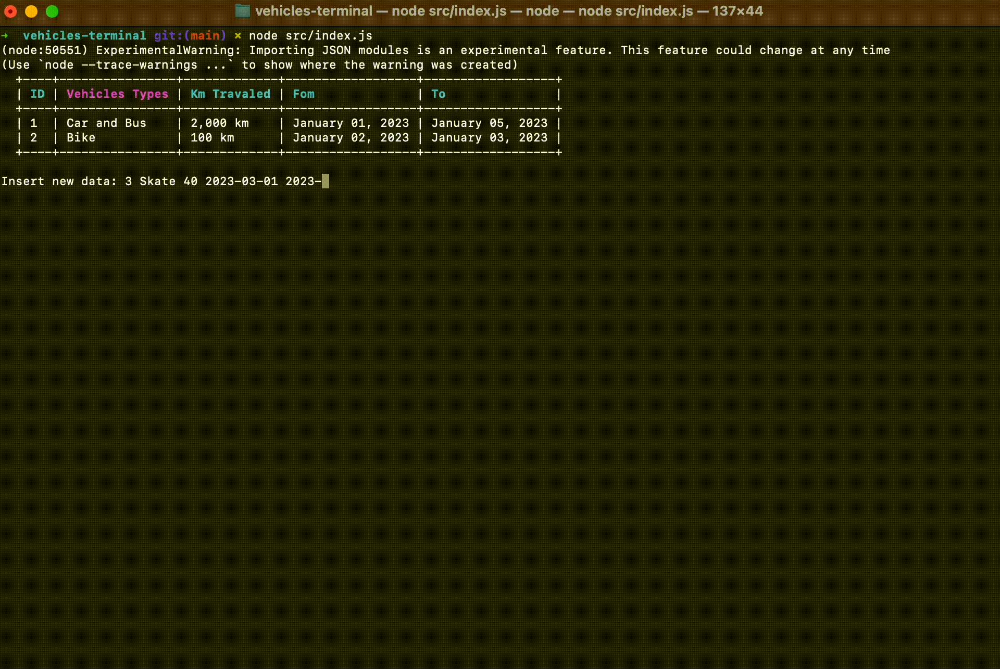

<h1 align="center">
    
</h1>

<h4 align="center">
  Vehicles Terminar
</h4>

<div align="center">
  
</div>

<p align="center" style="width: 100%; display: flex; flex-direction: row; justify-content: center; margin: 20px 0;">
  <a href="#rocket-techs" style="margin: 0 10px">Description</a> |
  <a href="#rocket-techs" style="margin: 0 10px">Technologies</a> |
  <a href="#notebook-running"style="margin: 0 10px">Running</a>
</p>
<br>

## :book: Description
Built only with Node.js, this project was made to training about js concepts, tests and how to use a beauty terminal application 😝

## :rocket: Technologies

- [Node.js](https://nodejs.org/)

## :notebook: Running

```bash
# Faça o clone
$ git clone git@github.com:glauberbrack/vehicles-terminal.git
# Navegue até a pasta do projeto
$ cd vehicles-terminal
# Install depencies
$ npm install
# Run
$ npm run dev
# Test
$ npm run test
# See test coverage
$ npm run test:cov
```

---